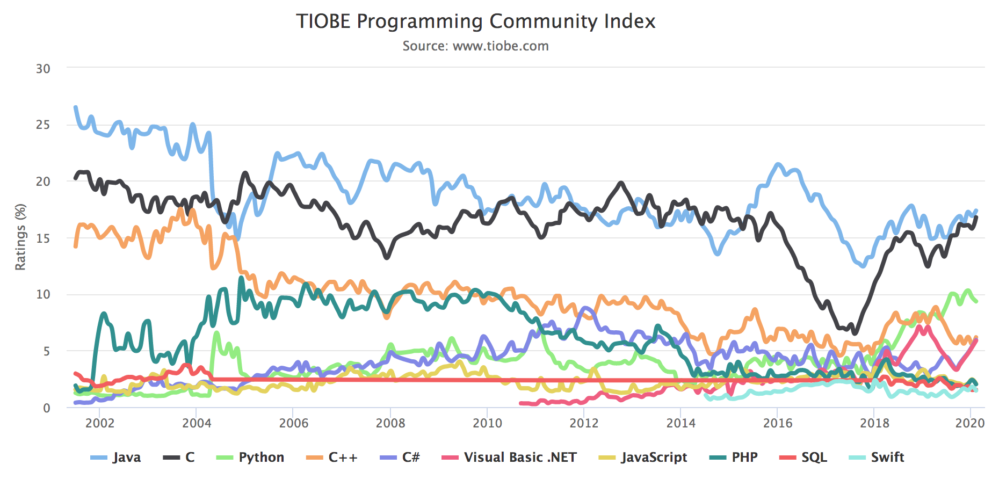

I've used Java for as long as I've been a coder.
My first computer science class in high school was Java, I used it all throughout college, I got my first internship in Java, which turned into my first job.  I got my Oracle Associate Certificate for Java 7, and I still use Java pretty much on a daily basis.  Even though I've picked up a lot of other languages and specialties like front end web development, I always consider myself a Java developer.  Java has been around for awhile now and that says a lot in the technology world where everything moves at the speed of light.

It's ubiquitous, and sometimes for the wrong reasons.  The Java semicolon is arguably just a popular as the oxford command, but much less forgiving.  There's a certain *stink* of the language due to its verbosity that modern day code hipsters can't stand (unless you're a [JHipster](https://www.jhipster.tech/)). Does the language still have any business being used in 2020?  Why did it get so popular in the first place?  For a language that's been so important to my own personal career, I wanted to spend some time to find the answers to these questions.

## Brief History

Java was first introduced to the world in 1996.  It was created by Sun Microsystems and was known for it's **write once, run everywhere** capability. This was in contrast to C/C++, which had to be built for each machine it ran on.  All of this was possible because of the Java Virtual Machine, or JVM.  Any device that ran a JVM could run a Java application.  JVMs were everywhere: PCs, phones, mainframes, microwave ovens, even credit cards.

Developers also liked using it because it made their lives easier.  It used [Garbage Collection](https://en.wikipedia.org/wiki/Garbage_collection_(computer_science)) to automatically manage an application's memory.  It's also an [Object Oriented](https://en.wikipedia.org/wiki/Object-oriented_programming) language.  Simply put, object oriented languages are well suited for large scale projects with multiple teams working on the same code base.

Sun started [marketing the hell out of Java](https://www.youtube.com/watch?v=TuXw0ZXXDuI) and soon it became the de facto standard for enterprise applications.  Today, Java is [the most popular language on the TIOBE Index](https://www.tiobe.com/tiobe-index/).  Java has a large community of developers who are very experienced with the language.  If you are looking to start a business, Java is an excellent choice because you'll be able to hire from a large pool of qualified applicants.  If you are a developer looking for a java, Java is an excellent choice because there are job opportunities out the wazoo.



## Strengths

Today, the strengths of the language are not the same as they once were in 1996.  **Write once, run anywhere** isn't important anymore because of the growth of cloud computing and virtualization in general.  Java source code is showing it's age as well.  There's a lot of boilerplate that just feels unnecessary.  Just look at the Hello World example.  Why do we need all of this just to print to the command line?  Try explaining this to a beginner programmer.  Shout out to Mr. Grey from Intro to Computer Science because he did it.
```java
public static void main(String args[]) {
    System.out.println("Hello, World");
}
```

The strengths of Java don't lie in the Java language itself, but the JVM instead.  The JVM has over 20 years of development and optimization by some of the largest companies in the world.  It's fast.  Like, really fast.  It's [one of the fastest modern languages in the world](https://stackoverflow.com/a/2163570/515411).  It uses [Just-it-time compiling](https://en.wikipedia.org/wiki/Just-in-time_compilation), which Wikipedia has the best explanation of.

> The Java virtual machine continually analyses program performance for hot spots which are executed frequently or repeatedly. These are then targeted for optimizing, [...] Some benchmarks show a 10-fold speed gain by this means.

The freaking thing learns!!  And then it get's better!!


You see, Java is a complied language.  A programmer starts with Java source code and then compiles it to Java Bytecode.  Then that Java Bytecode runs on a JVM.

* The libraries that are available
    * Personal opinion mixed with data.  The java libraries have had years of development and money invested into them
        by enterprise organizations.  They feel mature and production ready, sometimes more useful than Java itself, in the
        case of Google Guava.  In comparison, Node libraries feel like an open beta.
    * JUnit and Mockito
    * Jackson
    * Hibernate
    * Spring
    * A large part of the Java ecosystem is Spring.  I'll write another post on that shortly
* The tooling built around Java
* Performance
    * The JVM fast.  Benchmarking is a dangerous thing to do and I'm not going to tell you it's faster than Javascript (V8)
        https://rclayton.silvrback.com/speaking-intelligently-about-java-vs-node-performance
    * Amazon Story

## Kotlin

* Google announced that [Kotlin will become a first class language on Android](https://blog.jetbrains.com/kotlin/2017/05/kotlin-on-android-now-official/)
* Kotlin compiles to Java byte code, which means it runs on the JVM
* It is 100% Interoperable with Java
* It's concise
* It has learned from a lot of the pain points of Java
* It's different than Scala, Groovy, and other JVM languages.  It's more general purpose

## Other JVM languages

* Groovy
    * Dynamically Typed Java.
    * Working with [collections](https://docs.groovy-lang.org/next/html/documentation/working-with-collections.html) is pretty great
    * https://www.reddit.com/r/java/comments/6wuj1i/what_does_rjava_think_of_groovy/
* Scala
    * Good for big data processing
    * https://www.codementor.io/@jessicathornsby/kotlin-vs-scala-what-should-i-choose-instead-of-java-bwn9axvr8
    * Kotlin has [overtaken Scala](https://snyk.io/blog/kotlin-overtakes-scala-and-clojure-to-become-the-2nd-most-popular-language-on-the-jvm/)

## Conclusion

* Employability is always important to me
* I don't see Java (JVM) going anywhere
* Kotlin could be the next step for the language.  It's officially supported for Android development
* It's built by one of my favorite companies, Jetbrains.  Who make *the best* IDE in the world


